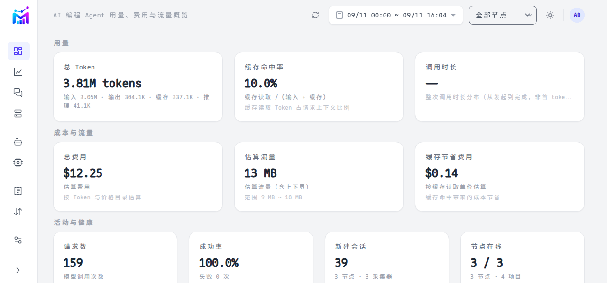

<div align="center">


<p><strong>轻量、可自托管的 AI 编程 Agent 用量监控平台</strong></p>

<p>统一查看 Token、费用和估算流量，不修改客户端，不代理模型请求。</p>

[](https://github.com/SuPerCxyz/metria/actions/workflows/ci.yml)
[](LICENSE)

<br />

[快速开始](#快速开始) · [用户手册](docs/user-guide.md) · [部署指南](docs/deployment.md) · [架构](docs/architecture.md)

</div>

<p align="center">
  
</p>

## Metria 解决什么问题

Claude Code、Codex 和 OpenCode 的用量分散在各自的本地日志与数据库中。Metria 通过只读挂载增量读取这些数据，统一展示：

| 能力 | 说明 |
|---|---|
| 用量监控 | Token（输入 / 输出 / 缓存 / 推理）、调用次数、会话数，支持 Node、Agent、模型和时间范围筛选 |
| 费用分析 | `reported`、`calculated`、`estimated` 三种口径并存，价格快照可追溯 |
| 流量估算 | 基于内容和 Usage 估算请求/响应流量，提供上下界、来源和置信度 |
| 定时报告 | 日 / 周 / 月汇总，可通过 SMTP 邮件或 JSON Webhook 投递 |

## 核心能力

- **零侵入采集**：只读挂载客户端目录，不修改客户端配置，不使用代理，不拦截明文请求。
- **多节点汇总**：一个 Hub 汇总多个 Node、Collector、Client 和 Source。
- **增量处理**：JSONL 使用 offset/inode，SQLite 使用 rowid，不重复解析历史数据。
- **诚实数据**：缺失 Token 使用 `null`；估算流量始终标注「估算」，不冒充网卡或账单流量。
- **轻量部署**：SQLite + 单一 Hub 二进制，运行时镜像不含 Node.js。

## 定时用量报告

在 Web「设置 → 用量报告」中配置，无需修改客户端或重新部署 Agent：

- 日、周、月三个独立调度，可分别设置时间、周几或每月 1–28 号；
- 支持 SMTP 邮件和通用 JSON Webhook，可同时启用；
- 邮件同时提供 HTML 和纯文本正文，趋势图以内嵌 SVG 呈现，并与 Web 图表共享视觉样式；
- 报告包含 Token、调用数、会话数、费用、Top 模型、Top Agent 和估算流量；缺失口径不显示；
- 支持发送测试和结果查看；单渠道成功时不会重复显示总体成功提示；
- 同一自动调度周期只尝试一次，失败后本周期不会持续重试；测试发送和下一周期不受影响；
- 发送历史保留最新 30 条，设置页每页显示 10 条；
- 邮件当前不附带 PDF，设置开关仅控制邮件内嵌图表。

## 快速开始

前置：Hub 需要 Linux amd64/arm64、Docker 和 Docker Compose；Agent 原生运行支持 Linux amd64/arm64 与 Windows amd64。

### 体验 Demo

Demo 使用确定性合成数据，不读取真实客户端目录：

```bash
cargo run -p metria-cli -- hub --demo
```

打开 <http://localhost:8080>，使用本地 Admin 账号登录即可浏览总览、分析、模型、费用和估算流量页面。

### Docker Compose 部署

```bash
cp docker/.env.example docker/.env
# 编辑管理员密码、客户端目录和其他部署配置
vi docker/.env

# 启动 Hub
docker compose -f docker/compose.yaml up -d

# 如需运行 Agent，再启动 Agent compose
docker compose -f docker/compose.agent.yaml up -d
```

也可以使用 `docker/compose.full.yaml` 启动 Hub、Demo 和 Agent 的完整示例：

```bash
docker compose -f docker/compose.full.yaml --profile demo --profile agent up -d
```

节点接入、Push/Pull 模式和 OIDC 配置见 [部署指南](docs/deployment.md)。

### 添加 Agent 节点

登录 Web 后进入「节点 → 添加节点」，填写名称、平台、架构和连接方式，页面会生成一次性 Token 以及 Docker、Linux、Windows 安装命令。节点历史用量不会因删除节点身份而删除。完整流程见 [用户手册](docs/user-guide.md)。

## 容器与命令

```bash
# 本地构建 Hub 镜像
docker build -f docker/Dockerfile --target hub -t metria:dev .

# 多架构发布
VERSION=v0.3.0
docker buildx build --platform linux/amd64,linux/arm64 --target hub \
  -t "ghcr.io/SuPerCxyz/metria:$VERSION" --push .

# 健康检查
docker run --rm metria:dev healthcheck
```

同一二进制提供多个入口：

```text
metria hub          # Hub 服务（Web UI + API）
metria agent        # Agent（Collector）
metria import       # 客户端目录导入
metria doctor       # 环境诊断
metria healthcheck  # 容器健康检查
metria backup       # 数据库备份
metria restore      # 数据库恢复
metria mcp          # 只读 MCP 查询服务
metria version      # 版本信息
```

## 架构概览

| 层级 | 组件 | 主要职责 |
|---|---|---|
| 数据源 | Claude Code、Codex、OpenCode 的本地日志与数据库 | 只读挂载，不修改客户端 |
| 采集 | Agent / Collector | 增量扫描、归一化、流量估算、批量上传 |
| 汇聚 | Hub | 认证、校验、幂等入库、Rollup 和 SQLite 存储 |
| 展示 | Web UI | 用量、费用、流量、模型、会话和数据质量 |
| 报告 | Hub Scheduler | 日 / 周 / 月聚合后投递 HTML 邮件或 JSON Webhook |

核心概念见 [数据模型](docs/data-model.md)，完整设计见 [架构文档](docs/architecture.md)。

## 数据边界

Metria 不启动或重放 Claude Code、Codex、OpenCode，不代理模型 API，不修改客户端配置，也不挂载 Docker Socket。默认脱敏并不上传完整路径、用户名、Hostname、Git Remote、API Key、Authorization、Cookie 或 SSH 私钥。报告只发送汇总指标，不包含会话正文、提示词或代码；发送到外部 SMTP/Webhook 前请确认目标地址可信。

## 开发

前置：Rust stable、Node.js 24+、Docker。

```bash
# 全部质量门禁
bash scripts/check.sh

# Web 开发
cd web && npm ci && npm run dev

# Rust 测试
cargo test --workspace
```

运行时 Hub 镜像不含 Node.js；Node 只在前端构建阶段使用。更多信息见 [开发指南](docs/development.md)。

## 文档

| 主题 | 文档 |
|---|---|
| 用户手册 | [docs/user-guide.md](docs/user-guide.md) |
| 部署 | [docs/deployment.md](docs/deployment.md) |
| 运维、备份、升级与回滚 | [docs/operations.md](docs/operations.md) |
| 架构 | [docs/architecture.md](docs/architecture.md) |
| 数据模型 | [docs/data-model.md](docs/data-model.md) |
| API | [docs/api.md](docs/api.md) |
| Adapter | [docs/adapters.md](docs/adapters.md) |
| 隐私与数据诚实性 | [docs/privacy.md](docs/privacy.md) |
| 开发指南 | [docs/development.md](docs/development.md) |
| 开发计划 | [docs/development-plan-m1.md](docs/development-plan-m1.md) |
| 安全策略 | [SECURITY.md](SECURITY.md) |

## 许可

[Apache-2.0](LICENSE)
